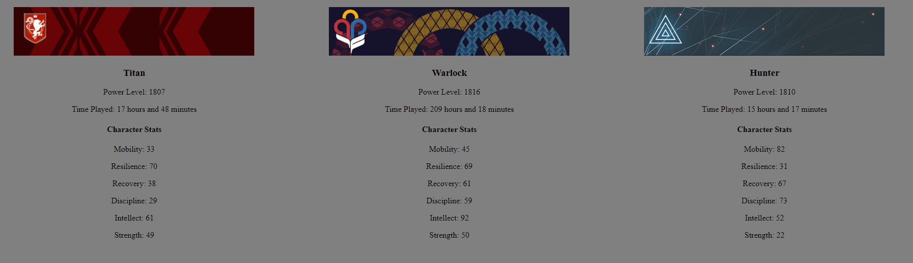

# DestinyAPI-Example
 Example usage for displaying Destiny Character Info from the Bungie API

NOT AFFILITATED WITH DESTINY OR BUNGIE IN ANY WAY

Info
- This example site aims to provide developers a starting point for their projects using the Bungie API
- It features only GET operations to display up to 3 characters, their class, emblem, power level, play time and stats.
- You will have to provide your own API key and membership ID for this to work

- You can do so much more with the API than is shown in this example such as displaying equipment and inventory however some features require authentication to work, read the official documentation to find out more

Sites you will need when working with the API:

- https://www.bungie.net/en/Application/
- https://data.destinysets.com/
- https://bungie-net.github.io

